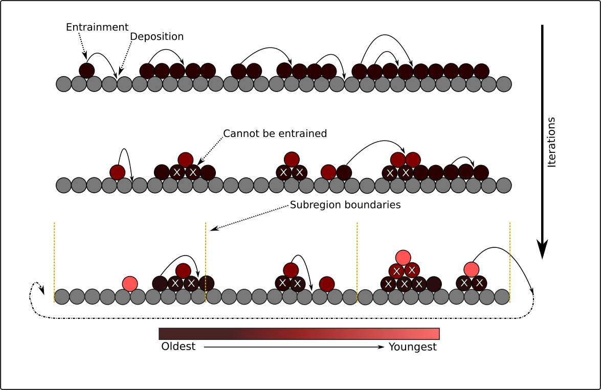

# Summary

Granular sediment of various sizes moves downstream along river beds when water flow is capable of entraining particles from 
the bed surface. This process is known as bed load sediment transport because the particles travel close to the boundary. 
It is common to treat the transport process as a predictive problem in which the mean transport rate past a stationary 
observation point is a function of local water flow conditions [@Parker:2008; @Wainwright:2014; @Ancey:2020]. A predictive approach 
introduces challenges to understanding bed load transport, however, because the stochastic nature of transport due to the 
movements of individual particles is neglected [@Einstein:1937; @FurbDoane:2021]. Here, we present an open-source Python model, `pySBeLT`, 
which simulates the kinematics of rarefied particle transport (low rates) as a stochastic process along a riverbed profile. 
The primary aim of `pySBeLT` is to examine connections between individual particle motions and local transport rates, or the flux.

# Statement of need

Research at the intersection of geomorphology, geophysics and hydraulics is increasingly focused on building 
a theoretical foundation for the treatment of bedload transport as a stochastic phenomenon [@Ancey:2020; 
@FurbDoane:2021]. Associated theories are commonly tested against laboratory data from "rarefied" transport 
conditions [@Furb:2016], where transport rates are low to moderate, interactions between two or more 
moving particles are rare, and a relatively small fraction of particles on the bed surface participate in transport 
[@Ancey:2010; @Roseberry:2012; @Fathel:2015; @Wu:2019]. For example, laboratory experiments 
using a downstream light table counting device and conducted at roughly twice the threshold for particle motion involve 
the transport of less than approximately 12% of particles on the upstream bed surface [@Chartrand:2017]. This result 
highlights that the flux measured across a boundary or within an area of bed surface is directly linked to the motions 
of individual particles arriving from upstream locations [@Furbish:2012]. 

Because particle motions are controlled by fluid turbulence, the irregular bed surface, and collective effects 
[@Ancey:2006; @Ancey:2008; @LeeJerol:2018], the connection between particle movements and the bedload 
transport rate has been difficult to formulate mathematically. `pySBeLT` provides an extensible framework within 
Python to numerically examine correlations between upstream particle entrainment rates and travel distances, with downstream 
flux. `pySBeLT` was motivated by a birth-death, immigration-emigration Markov model for bedload transport. Here, 
the movements of individual particles are represented by stochastic entrainment, motion, and deposition processes, and sediment 
flux is represented as a counting phenomenon where the number of particles in motion above the bed surface is a random 
variable [@Ancey:2008]. The model supports ensemble simulations so that repeat numerical experiments can be conducted efficiently,
or the problem can be probed across a range of input parameter values (discussed below).

`pySBeLT` is run forward in time according to default or user specified parameter values in **'param.yaml'** (see the README.md for 
more details). After initialization, `pySBeLT` first constructs a bed of fixed particles of set_diam in both the downstream and 
cross-stream dimensions (one particle wide in the present build), and over a downstream domain length **'x_max'**. Bed surface particles
of **'set_diam'** are then randomly placed at vertices between fixed bed particles until the **'pack_density'** is met. Vertices are defined 
by a contact point between two adjacent particles. The bed of surface particles is then separated into **'num_subregions"**, and at this 
point the forward simulations are ready to commence. 

Simulation iterations involve three steps: (1) the number of particle entrainment events per **'num_subregions'** are drawn from a Poisson pmf, 
and this is done randomly for each numerical step up to **'n_iterations'**; (2) surface particles from each subregion are randomly selected 
for entrainment, and if there are insufficient surface particles available for entrainment, then all available particles are moved; (3) each 
entrained particle moves a distance according to a randomly sampled value from either the normal or lognormal distribution, and is placed at 
the nearest vertex between two particles that is available for placement. Placed particles are permitted to stack up to the **'level_limit in height'**. 
Travel distances of particles that exceed **'x_max'** are returned and queued at the upstream boundary, and are introduced back into the 
domain at the next numerical step according to travel distance sampling described above. This overall process repeats for the specified n_iterations. 

`pySBeLT` tracks a number of different parameters through a simulation: the vertical and horizontal positions of every particle center, 
the randomly sampled number of entrainment events, the number of particles actually entrained, the randomly sampled particle travel 
distance, the actual particle travel distance, the particle ‘age’, or the number of numerical steps since last entrainment for every 
particle, and the number of particles which cross all boundaries, i.e. sub-region and downstream at x_max. All values are stored 
in HDF5 data files using the `h5py` package [@Collette:2014]. 

`pySBeLT` produces a time varying signal of particle flux counted at the downstream domain (as well as internal subregion domains), with a particle 
bed that changes through particle stacking and pile removal, and downstream motions of travel distance (Fig. 1). An implication of particle 
stacking within the context of the `pySBeLT` stochastic framework is a time varying signal of the average “particle age”, as well as the 
average “particle age range”, defined as the difference of the maximum and minimum particle ages. The model can be readily modified to simulate 
kinematics using different probability distributions, or examining particle age dynamics for deeper beds of particles available for transport. The relatively 
simple parameterization of `pySBeLT` execution also makes it suitable for use as a teaching tool within advanced undergraduate and graduate courses 
emphasizing bed load sediment transport.

# Figures

|
|:--:| 
| *Example `py_SBeLT` output of particle flux at downstream boundary and particle bed configuration at numerical step 100* |

# Acknowledgements

S. Zwiep was funded in part through an Undergraduate Student Research Award from the 
National Science and Engineering Research Council of Canada (NSERC). S.M. Chartrand was 
funded through a Postdoctoral Fellowship awarded by NSERC, and through internal research 
funding provided by Simon Fraser University. The model was inspired by discussions with 
David Jon Furbish, who also provided useful input and critical feedback at various stages 
of model development and testing. Kevin Pierce also provided helpful feedback during model 
development. Greg Baker provided insightful mentorship for S. Zwiep during improvements to the model.

# References
